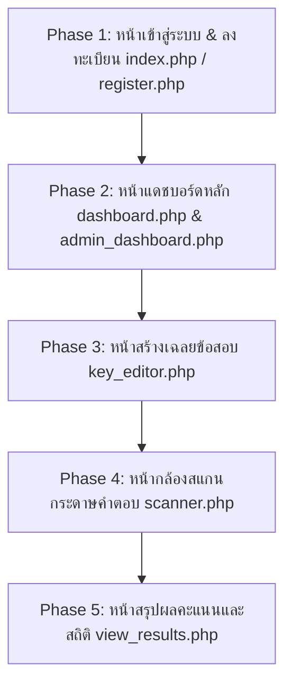

# MSU Scoring Web - UI/UX Design System & Improvement Plan

> **เอกสารข้อกำหนดและแนวทางการออกแบบ UI/UX สำหรับระบบตรวจข้อสอบ MSU Scoring**  
> **องค์กร:** มหาวิทยาลัยมหาสารคาม (Mahasarakham University - MSU)  
> **อัตลักษณ์สีประจำมหาวิทยาลัย:** สีเหลือง - เทา (Yellow & Gray)

---

## 1. ข้อมูลระบบและวัตถุประสงค์ (Project Overview)

* **ชื่อระบบ:** MSU Scoring System (ระบบตรวจกระดาษคำตอบและประมวลผลข้อสอบปรนัย)
* **วัตถุประสงค์หลัก:** ช่วยให้อาจารย์และเจ้าหน้าที่ มหาวิทยาลัยมหาสารคาม สามารถสร้างชุดข้อสอบ กำหนดเฉลย สแกนตรวจกระดาษคำตอบผ่านกล้อง/รูปภาพ และดูรายงานสถิติคะแนนได้อย่างรวดเร็ว แม่นยำ และมีประสิทธิภาพ
* **กลุ่มผู้ใช้งานหลัก (Target Users):**
  1. **คณาจารย์ (Instructors):** ต้องการความสะดวกในการสร้างข้อสอบ สแกนกระดาษคำตอบที่รวดเร็ว แก้ไขเฉลยง่าย และดูผลคะแนนพร้อมส่งออกรายงาน PDF/Excel
  2. **เจ้าหน้าที่วิชาการ/วัดผล (Academic Staff):** ต้องการตรวจสอบสถิติข้อสอบ ความยากง่าย (p, r) ค่าอำนาจจำแนก และบริหารจัดการชุดข้อสอบ
  3. **ผู้ดูแลระบบ (Admins):** จัดการสิทธิ์ผู้ใช้งาน สถิติการใช้งานเครื่องสแกน และการเชื่อมต่อระบบ

---

## 2. อัตลักษณ์ทางการมองเห็นและโทนสี (Brand Identity & Color Palette)

อิงตามสีประจำมหาวิทยาลัยมหาสารคาม **"สีเหลือง - เทา"** โดยปรับระดับเฉดสี (Color Tokens) ให้ได้มาตรฐาน **WCAG 2.1 AA** (Contrast ratio อย่างน้อย 4.5:1 สำหรับตัวอักษร) เพื่อให้อ่านง่ายและเข้าถึงได้ดี (Accessibility):

### 🟡 2.1 MSU Yellow (โทนสีเหลืองทอง มมส)
* **Primary Yellow (สีเหลืองหลัก):** `#EAB308` (`amber-500` / `yellow-500`)
* **Primary Hover / Active:** `#D97706` (`amber-600`) / `#CA8A04` (`yellow-600`)
* **Yellow Soft Background:** `#FEF9C3` (`yellow-100`) / `#FFFBEB` (`amber-50`)
* **Yellow Border / Ring:** `#FDE047` (`yellow-300`) / `#F59E0B` (`amber-500`)
* **Text on Yellow Button:** `#0F172A` (`slate-900` - ตัวอักษรสีเข้มเพื่อ Contrast ที่ชัดเจน)

### 🔘 2.2 MSU Gray & Neutral (โทนสีเทา มมส)
* **Dark Slate/Gray (หัวข้อ/ตัวหนังสือหลัก):** `#0F172A` (`slate-900`) / `#1E293B` (`slate-800`)
* **Body Gray (ตัวหนังสือเนื้อหา):** `#334155` (`slate-700`) / `#475569` (`slate-600`)
* **Muted Gray (ข้อความรอง/คำอธิบาย):** `#64748B` (`slate-500`)
* **Border Gray (เส้นขอบการ์ด/เส้นแบ่ง):** `#E2E8F0` (`slate-200`) / `#CBD5E1` (`slate-300`)
* **Background Light Gray (พื้นหลังเว็บ):** `#F8FAFC` (`slate-50`) / `#F1F5F9` (`slate-100`)

### 🟢 2.3 System Status Colors (สีสถานะสนับสนุน)
* **Success (ผ่าน/สมบูรณ์):** `#10B981` (`emerald-500`), Background `#ECFDF5` (`emerald-50`)
* **Danger/Error (ข้อผิดพลาด/ลบ):** `#EF4444` (`red-500`), Background `#FEF2F2` (`red-50`)
* **Warning (เตือน/ตรวจสอบ):** `#F59E0B` (`amber-500`), Background `#FFFBEB` (`amber-50`)
* **Info (ข้อมูล/ช่วยเหลือ):** `#3B82F6` (`blue-500`), Background `#EFF6FF` (`blue-50`)

### ✍️ 2.4 Typography (แบบอักษร)
* **Font Family หลัก:** `'Sarabun'`, system-ui, sans-serif (อ่านภาษาไทยง่าย เป็นทางการ สะอาดตา)
* **Hierarchy:**
  * Page Title: `text-2xl` หรือ `text-3xl`, Font Weight `700` (`font-bold`)
  * Section Header: `text-lg` หรือ `text-xl`, Font Weight `600` (`font-semibold`)
  * Body: `text-base` (16px) หรือ `text-sm` (14px), Font Weight `400` / `500`
  * Caption/Helper: `text-xs` (12px), Color `slate-500`

---

## 3. สกิลที่ใช้ในการวิเคราะห์และปรับปรุง (Applied Skills)

1. **`impeccable` (UI Audit & Refinement):**
   * ตรวจสอบ Visual Hierarchy, Spacing, Touch Targets (ปุ่มกดขนาดไม่ต่ำกว่า 44×44px บนมือถือ)
   * ตรวจสอบ micro-interactions, loading states, และ error boundaries
2. **`ui-ux-pro-max` (Design Intelligence & Pattern Rules):**
   * อิงกฎ Accessibility, Form validation, Data tables, และ Camera Scanner View UX
3. **`frontend-design` (Distinctive Identity & Layout polish):**
   * จัดระเบียบการ์ดข้อสอบ Dashboard ให้ดูน่าใช้ สะอาดตา เป็นระเบียบ ไม่เหมือน AI-generated template ซ้ำๆ

---

## 4. แผนงานการปรับปรุงแยกตามหน้าเว็บ (UI/UX Improvement Roadmap)

### 📍 หน้าที่ 1: `index.php` & `register.php` (หน้า Login & Register)
* **สถานะปัจจุบัน:** แบบฟอร์มพื้นฐานเรียบง่าย
* **แนวทางปรับปรุง:**
  * ปรับโทนสีปุ่มและ Accent ให้เป็น MSU Yellow (`amber-500`/`slate-900`) ที่ชัดเจน
  * เพิ่ม Hero Graphic/Branding ด้านข้าง หรือการ์ดต้อนรับตราชื่อ มหาวิทยาลัยมหาสารคาม
  * เพิ่มความนุ่มนวลของ Shadow และ Border Radius ให้ทันสมัย
  * ปรับแต่งปุ่ม Google Sign-in ให้กลมกลืนกับธีมสี

### 📍 หน้าที่ 2: `dashboard.php` (แดชบอร์ดจัดการรายวิชา/ชุดข้อสอบ)
* **สถานะปัจจุบัน:** มีตารางและบอร์ดการ์ดข้อสอบ
* **แนวทางปรับปรุง:**
  * ปรับ Top Navbar ให้มีตราย่อ MSU และสถานะผู้ใช้ที่ชัดเจน
  * ปรับการ์ดชุดข้อสอบ (Exam Cards) ให้แสดงสถานะ (จำนวนข้อ, จำนวนกระดาษที่สแกนแล้ว, วันที่สร้าง) ในรูปแบบ Badge สวยงาม
  * เพิ่ม Quick Action Buttons (สร้างชุดข้อสอบใหม่, สแกนด่วน, ดูผลคะแนน) ด้วยโทนสี MSU Yellow-Gray
  * ปรับปรุง Empty State (กรณีพึ่งสร้างบัญชีใหม่ยังไม่มีชุดข้อสอบ) ให้มีปุ่มสร้างแนะนำที่ชัดเจน

### 📍 หน้าที่ 3: `key_editor.php` (เครื่องมือจัดการเฉลยข้อสอบ)
* **สถานะปัจจุบัน:** มีตารางกรอกข้อ 1-100 หรือตัวเลือก A B C D E
* **แนวทางปรับปรุง:**
  * ปรับ Layout ตารางให้กรอกง่าย (Grid layout/Keypad layout) รองรับทั้งการคลิกและการใช้คีย์บอร์ด (Tab/Arrow keys)
  * Highlight ข้อที่ยังไม่ได้เฉลยด้วยสีเตือน (Soft Amber)
  * เพิ่มระบบ Autosave indicator และปุ่มบันทึกเฉลยที่โดดเด่น

### 📍 หน้าที่ 4: `scanner.php` (หน้าสแกนกระดาษคำตอบผ่านกล้อง/ไฟล์)
* **สถานะปัจจุบัน:** มีช่อง Viewfinder แสดงภาพกล้องสดและการประมวลผล
* **แนวทางปรับปรุง:**
  * ปรับ Viewfinder / Overlay ให้เห็นกรอบวางกระดาษคำตอบที่ชัดเจน (High Contrast guide lines)
  * เพิ่ม Sound/Visual Feedback เมื่อสแกนผ่านสำเร็จ (Flash green border / Toast alert)
  * ปรับปุ่มควบคุมกล้อง (สลับกล้อง, เปิดแฟลช, อัปโหลดรูป) ให้เป็น Floating Action Controls ขนาดใหญ่ กดง่ายบนแท็บเล็ต/มือถือ

### 📍 หน้าที่ 5: `view_results.php` (หน้าวิเคราะห์และสรุปผลคะแนน)
* **สถานะปัจจุบัน:** ตารางคะแนนและกราฟสถิติ
* **แนวทางปรับปรุง:**
  * เพิ่ม Summary KPI Cards ด้านบน (คะแนนเฉลี่ย, คะแนนสูงสุด-ต่ำสุด, จำนวนผู้เข้าสอบ, ค่าความเชื่อมั่น KR-20)
  * ปรับโทนสีกราฟ Chart.js ให้อิงตาม Palette สี MSU (Yellow, Slate Gray, Emerald)
  * ปรับตารางคะแนนรายบุคคลให้ค้นหา (Filter/Search) และเรียงลำดับ (Sort) ได้สะดวก

---

## 5. การตรวจสอบความเรียบร้อย (Verification Checklist)

- [ ] **Contrast Check:** ข้อความทั้งหมดมี Contrast ratio อย่างน้อย 4.5:1 อ่านง่ายสบายตา
- [ ] **Responsive Design:** แสดงผลได้ดีทั้งบนหน้าจอ Desktop, Tablet, และ Mobile (รองรับกล้องแท็บเล็ตขณะตรวจข้อสอบ)
- [ ] **Brand Consistency:** ทุกหน้าใช้โทนสี MSU Yellow-Gray เดียวกัน ไม่มีเฉดสีหลุดธีม
- [ ] **Feedback & States:** ทุกปุ่มมี Hover / Active / Loading state ชัดเจน
